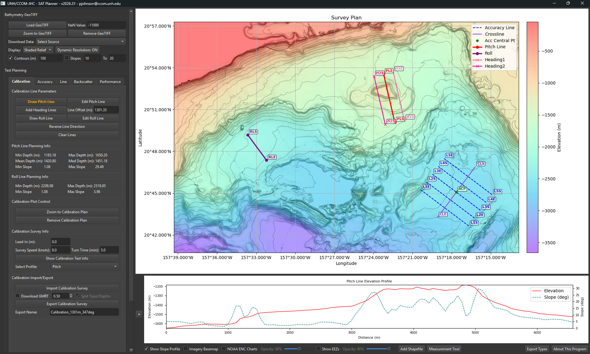

# SAT/QAT Planner



A comprehensive Shipboard Acceptance Testing (SAT) and Quality Assurance Testing (QAT) planning tool with GeoTIFF support, built with PyQt6. The GUI uses a consistent dark theme so the app works well in both light and dark system themes.

## Overview

The SAT/QAT Planner is a desktop application designed for planning and visualizing multibeam testing operations. It supports three main planning modes:
- **Calibration Survey Planning**: Plan pitch, roll, and heading calibration lines
- **Reference Survey Planning**: Generate parallel survey lines with customizable parameters
- **Line Planning**: Interactive line drawing with real-time elevation profiles

## Features

### Core Functionality
- **Multi-tab Interface**: Separate tabs for Calibration, Reference, and Line planning (left panel)
- **Dark Theme**: Qt GUI always uses a dark theme; map (matplotlib) keeps default styling
- **GeoTIFF Support**: Load and visualize elevation data from GeoTIFF files
- **GMRT Download**: Optional download of GMRT bathymetry GeoTIFF when importing surveys (Calibration, Reference, Line tabs; configurable buffer)
- **Download GMRT GeoTIFF**: Button opens a separate "Download GMRT Grid" dialog to fetch GMRT bathymetry as GeoTIFF; when split (topo/bathy) is used, SAT Planner loads the bathy grid
- **Dynamic Resolution**: Automatically adjust GeoTIFF resolution based on zoom level
- **Interactive Plotting**: Pan (middle mouse), zoom (scroll), and interact with survey plans on the map (no toolbar)
- **Real-time Statistics**: Calculate survey distances, times, and comprehensive statistics
- **Elevation Profiles**: View elevation and slope profiles for drawn lines
- **Activity Log**: Fixed on the right side (320 px wide) below the map, next to the profile/options strip
- **Export Capabilities**: Export survey plans in CSV and Shapefile formats
- **Survey Import**: Import calibration/reference/line plans from DDD, DMS, DMM, LNW, CSV, and GeoJSON

### Calibration Survey Planning
- Draw pitch and roll calibration lines interactively
- Generate heading calibration lines from pitch line
- Calculate heading line offset based on median depth
- Display pitch line depth statistics (shallowest, maximum, mean, median)
- Configure turn time for accurate time estimates
- Import calibration surveys (DDD/DMS/DMM/LNW, CSV, GeoJSON); optional GMRT download after import (checkbox + buffer)
- Comprehensive statistics with survey time, transit time, and turn time breakdowns
- Validation warning when heading line offset exceeds 2x shallowest depth
- Export calibration survey plans with detailed statistics

### Reference Survey Planning
- Generate parallel survey lines with customizable parameters
- Auto-regenerate plans when parameters change (with debounce)
- Configure line length, spacing, heading, speed, and turn time
- Import reference surveys (DDD/DMS/DMM/LNW, CSV, GeoJSON); optional GMRT download after import (checkbox + buffer)
- Calculate comprehensive survey statistics with time breakdowns
- Survey time breakdown showing main lines, crossline, transit, and turn times
- Export reference survey plans with detailed statistics

### Line Planning
- Interactive line drawing with waypoint support
- Real-time elevation profiles as you draw
- Edit existing lines by dragging waypoints
- Import/export line plans (DDD, DMS, DMM, LNW, CSV, GeoJSON; single polyline, no assignment dialog)
- Optional GMRT download after import (checkbox + buffer)
- Calculate survey statistics for drawn lines

### GeoTIFF Visualization
- Display elevation data with color mapping
- Toggle between elevation and slope visualization
- Hillshade rendering for better terrain visualization
- Dynamic resolution loading for performance
- Support for various coordinate reference systems (CRS)
- Survey plan axis labels in degrees–decimal minutes (DDM)

## Requirements

### Python Version
- Python 3.7 or higher

### Core Dependencies
- PyQt6
- matplotlib
- numpy

### Geospatial Dependencies (Required for GeoTIFF support)
- rasterio
- pyproj
- shapely
- fiona

### Optional
- **Pillow (PIL)** – for Imagery Basemap and NOAA ENC Charts overlays
- **requests** – for GMRT bathymetry download (dialog and on import) – for GMRT bathymetry download when using “Download GMRT” on import

## Project structure

The application is organized as a package plus a launcher:

- **`SAT_Planner_PyQt.py`** – Entry point; creates the main window and runs the app (`python SAT_Planner_PyQt.py`).
- **`sat_planner/`** – Core package:
  - **`constants.py`** – Version, config path, geospatial library availability.
  - **`utils_geo.py`** – Coordinate helpers (e.g. decimal degrees to DDM).
  - **`utils_ui.py`** – UI helpers (message boxes, confirmations).
  - **`gmrt_dialog/`** – Embedded GMRT Download dialog (config, workers, map_widget, main_window); GeoTIFF-only output, optional split into topo/bathy.
  - **`mixins/`** – Feature mixins used by the main window:
    - **BasemapMixin** – Imagery basemap and NOAA ENC Charts overlays.
    - **GeoTIFFMixin** – Load/remove GeoTIFF, display mode, dynamic resolution, contours.
    - **PlottingMixin** – Survey plan plot, limits, colorbars, DDM axis labels.
    - **SurveyParsersMixin** – DDD/DMS/DMM/LNW parsers (lines and polylines), UTM zone dialog.
    - **GMRTDownloadMixin** – GMRT GridServer download and load GeoTIFF.
    - **ReferenceMixin** – Reference tab, survey lines, export/import, optional GMRT on import.
    - **CalibrationMixin** – Calibration tab, pitch/roll/heading lines, export/import, optional GMRT on import.
    - **LinePlanningMixin** – Line planning tab, draw/edit, profile, statistics, optional GMRT on import.
    - **ProfilesMixin** – Crossline, pitch, and line-planning elevation profiles.
    - **MapInteractionMixin** – Click, scroll, pan, zoom, pick center/pitch/roll.
    - **ExportImportMixin** – Save/load parameters, export survey files.
    - **ConfigMixin** – Last-used directories, config load/save.

## Installation

### Option 1: Using Pre-built Executable

Download the latest executable from the [Releases](https://github.com/seamapper/SAT_Planner/releases) page:
- `SAT_Planner_v2026.08.exe` (Windows) or newer — version is in the filename (see `sat_planner/constants.py`).
- `SAT_Planner.app` (macOS) — if available

No installation required - just run the executable or app bundle.

### Option 2: From Source

1. Clone the repository:
```bash
git clone https://github.com/seamapper/SAT_Planner.git
cd SAT_Planner
```

2. Install dependencies:

**Using pip:**
```bash
pip install PyQt6 matplotlib numpy rasterio pyproj shapely fiona Pillow requests
```
(`requests` is used for GMRT bathymetry download.)

**Using conda (recommended for Windows and macOS):**
```bash
conda install -c conda-forge pyqt matplotlib numpy rasterio pyproj shapely fiona pillow
```

3. Run the application:
```bash
python SAT_Planner_PyQt.py
```

## Building from Source

### Building for Windows

1. Install PyInstaller:
```bash
pip install pyinstaller
```

2. Run the build script (edit `build_exe.bat` to set `PYTHON_PATH` and the spec filename if needed):
```bash
build_exe.bat
```

Or build manually with a PyInstaller spec file; the executable will be created in the `dist` folder.

### Building for macOS

To build a macOS application (.app bundle):

1. **Install PyInstaller**:
```bash
pip install pyinstaller
```

2. **Prepare the icon file** (if needed):
   - The spec file uses `media/CCOM.icns` for the app icon
   - If you only have `CCOM.ico`, convert it to `.icns` format:
```bash
# Using sips (built into macOS):
sips -s format icns media/CCOM.ico --out media/CCOM.icns
```

3. **Build the app bundle** using the provided macOS spec file:
```bash
pyinstaller Sat_Planner_macOS.spec
```

4. **The app bundle will be created** in the `dist` folder as `SAT_Planner.app`

5. **Optional: Code signing** (recommended for distribution):
```bash
codesign --deep --force --verify --verbose --sign "Developer ID Application: Your Name" dist/SAT_Planner.app
```

6. **Optional: Create a DMG for distribution**:
   - Use Disk Utility or a tool like `create-dmg` to create a disk image
   - Example with create-dmg:
```bash
npm install -g create-dmg
create-dmg dist/SAT_Planner.app dist/
```

**Notes for macOS builds:**
- Use `.icns` format for icons (convert `.ico` files using `sips` or online converters)
- The app bundle can be distributed as-is or packaged in a DMG
- Code signing is optional but recommended to avoid macOS security warnings
- Test the app bundle on a clean macOS system to ensure all dependencies are included

## Usage

### Basic Workflow

1. **Load GeoTIFF** (optional): Click "Load GeoTIFF" to load elevation data, or click "Download GMRT GeoTIFF" to open the GMRT dialog and download bathymetry (GeoTIFF-only; if you use split, the app loads the bathy grid)
2. **Enable Map Overlays** (optional): Toggle Imagery Basemap or NOAA ENC Charts checkboxes and adjust opacity sliders
3. **Select Planning Mode**: Choose between Calibration, Reference, or Line tabs
4. **Configure Parameters**: Set survey parameters in the appropriate tab
5. **Generate/Plan**: Create survey lines based on parameters or draw interactively
6. **View Statistics**: Click "Show [Type] Test Info" to view survey statistics
7. **Export**: Save survey plans using the Export buttons

### Calibration Survey Planning

1. Load a GeoTIFF (recommended)
2. Click "Draw a Pitch Line" and click start/end points on the map
3. Configure Turn Time (min) in Calibration Info - default: 5 minutes
4. Click "Add Heading Lines" to generate heading calibration lines (warning shown if offset > 2x shallowest depth)
5. Click "Draw a Roll Line" and click start/end points
6. View comprehensive statistics showing survey time, transit time, and turn time breakdowns
7. Export as needed (statistics file includes all details from dialog)

### Reference Survey Planning

1. Optionally load a GeoTIFF and pick a center point (view stays at current zoom)
2. Enter survey parameters:
   - Central Latitude/Longitude
   - Number of Lines
   - Line Length
   - Heading
   - Distance Between Lines
   - Survey Speed
   - Turn Time (min) - default: 5 minutes
3. The plan auto-regenerates as you change parameters
4. View comprehensive statistics with survey time, transit time, and turn time breakdowns
5. Export the plan

### Line Planning

1. Load a GeoTIFF (recommended)
2. Click "Start Drawing Line"
3. Left-click to add waypoints
4. Right-click to finish the line
5. Edit by clicking "Edit Line Planning" and dragging waypoints
6. View elevation profile and statistics
7. Export the line plan

### Download GMRT Grid Dialog

Click **"Download GMRT GeoTIFF"** in the GeoTIFF Control section to open the **Download GMRT Grid** window (separate from the main app). In the dialog you can:

- Set the area of interest (North/South/East/West or draw on the map)
- Choose **Cell Resolution**: 100 m, 200 m, 400 m, or **Custom** (e.g. 50 m); default is 100 m
- Optionally **Split Grid Into Bathymetry and Topography**; when enabled, SAT Planner loads the bathymetry grid after download
- A warning (orange text) appears when estimated pixels exceed 16,000,000
- Use **"Close GMRT Downloader"** at the bottom to close the dialog

Downloads are always GeoTIFF. The dialog uses its own config: `~/.gmrtgrab_sat_planner_config.json`.

### Map Overlays

1. **Imagery Basemap**: Check the "Imagery Basemap" checkbox to overlay satellite imagery
   - Adjust opacity using the slider (0-100%)
   - The basemap updates automatically as you pan and zoom

2. **NOAA ENC Charts**: Check the "NOAA ENC Charts" checkbox to overlay navigational charts
   - Adjust opacity using the slider (0-100%)
   - Charts are requested with equal cell size and properly reprojected for display
   - Charts update automatically as you pan and zoom

## Configuration

The application saves configuration in:
- `~/.cal_ref_planner_config.json` (user preferences)
- Last used directories
- Survey parameters

## Export Formats

- **CSV**: Survey lines with coordinates and metadata
- **Shapefile**: Geospatial vector format for GIS applications
- **Statistics Reports**: Text reports with distances, timing, and survey details

## Navigation

### Mouse Controls (no toolbar)
- **Left Click**: Add waypoint (in drawing mode); pick points in calibration/reference/line modes
- **Right Click**: Finish drawing line
- **Middle Mouse Button**: Pan the map
- **Scroll Wheel**: Zoom in/out

## Troubleshooting

### GeoTIFF Loading Issues

- Ensure the GeoTIFF file is valid and not corrupted
- Check that the file uses a supported CRS
- Large files may take time to load - be patient
- Try enabling "Dynamic Resolution" for better performance

### Import Errors

If you encounter `ModuleNotFoundError` for geospatial libraries:

1. **Install dependencies**: Run `pip install rasterio pyproj shapely fiona`
2. **Windows users**: Consider using conda or OSGeo4W for easier installation
3. **Check Python environment**: Ensure you're using the correct Python environment

### Application Runs Without GeoTIFF Support

The application will run with limited functionality if geospatial libraries aren't available:
- Basic survey planning still works
- GeoTIFF loading will be disabled
- A warning message will be displayed

### Performance Issues

- Large GeoTIFF files may cause slow loading
- Enable "Dynamic Resolution" to improve performance
- Consider using smaller tiles or downsampled data
- Close other applications to free up memory

## Version History

- **v2026.09** (or later): Integrated GMRT Download dialog: "Download GMRT GeoTIFF" button opens a separate "Download GMRT Grid" window. Dialog is GeoTIFF-only (no output format selector); cell resolution 100/200/400 m or Custom (default 50 m), default preset 100 m. Large-area warning when estimated pixels > 16,000,000 (orange). When split (topo/bathy) is used, SAT Planner loads the bathy grid. "Close GMRT Downloader" button at bottom of dialog. Activity Log width 320 px.
- **v2026.08**: Dark theme for Qt GUI (Fusion + dark palette). Activity Log moved to right side below map (380 px wide). GMRT download option on Calibration, Reference, and Line import (checkbox + buffer). Line plan import from DDD/DMS/DMM/LNW/CSV/GeoJSON. Navigation toolbar removed; zoom (scroll) and pan (middle mouse) only. Survey parsers and GMRT download in dedicated mixins.
- **v2026.04**: Updated hover text to display coordinates in degrees and decimal minutes (DDM) format instead of decimal degrees. Changed default window height to 1110 pixels.
- **v2026.02**: Added Turn Time parameter to Calibration and Reference Info tabs. Enhanced statistics displays with Total Survey Time and Total Transit Time breakdowns. Fixed autozoom issue when picking center from GeoTIFF. Added validation warning when heading line offset exceeds 2x shallowest depth. Updated export functions to include comprehensive statistics matching dialog displays.
- **v2026.01**: Refactored into `sat_planner` package with mixins (Basemap, GeoTIFF, Plotting, Reference, Calibration, Line Planning, Profiles, Map Interaction, Export/Import, Config). Survey plan axes show DDM (degrees–decimal minutes) tick labels. Moved basemap/NOAA and geotiff/plotting helpers into mixins.
- **v2025.11**: Fixed Dynamic Resolution for toolbar zoom/pan operations, updated About this Program dialog
- **v2025.10**: Added Imagery Basemap and NOAA ENC Charts overlays with opacity controls, navigation toolbar at bottom of map, fixed Dynamic Resolution for toolbar zoom/pan, improved map visualization
- **v2025.09**: Made profile colors coordinate with survey plot
- **v2025.08**: Added About button to profile plot
- **v2025.07**: Added ability to plan all tests simultaneously, fixed profile plot updates
- **v2025.06**: Fixed labeling of waypoints in line planning tab, fixed preservation of lines when changing tabs
- **v2025.05**: Added ability to plan all tests simultaneously, fixed profile plot updates, improved dynamic resolution
- **v2025.04**: Converted to PyQt6
- **v2025.03**: Added line planning, import/export of lines
- **v2025.02**: Added metadata file saving/loading, contour interval synchronization
- **v2025.01**: Initial release

## Contributing

Contributions are welcome! Please feel free to submit a Pull Request.

## License

This project is licensed under the BSD 3-Clause License - see the [LICENSE](LICENSE) file for details.

Copyright (c) 2025, University of New Hampshire Center for Coastal and Ocean Mapping / Joint Hydrographic Center (UNH/CCOM-JHC)

## Contact

For questions or issues, please contact:
- Email: pjohnson@ccom.unh.edu
- Organization: UNH/CCOM-JHC

## GMRT

Bathymetry/topography data available through the Download GMRT Grid dialog and the GMRT download-on-import options are from the Global Multi-Resolution Topography (GMRT) synthesis:

Ryan, W. B. F., S.M. Carbotte, J. Coplan, S. O'Hara, A. Melkonian, R. Arko, R.A. Weissel, V. Ferrini, A. Goodwillie, F. Nitsche, J. Bonczkowski, and R. Zemsky (2009), Global Multi-Resolution Topography (GMRT) synthesis data set, *Geochem. Geophys. Geosyst.*, 10, Q03014, doi:[10.1029/2008GC002332](https://doi.org/10.1029/2008GC002332).

Data doi: [10.1594/IEDA.100001](https://doi.org/10.1594/IEDA.100001).

## Acknowledgments

Developed at the University of New Hampshire, Center for Coastal and Ocean Mapping - Joint Hydrographic Center (UNH/CCOM-JHC) under grant NA25NOSX400C0001-T1-01 from the National Oceanic and Atmospheric Administration (NOAA).

