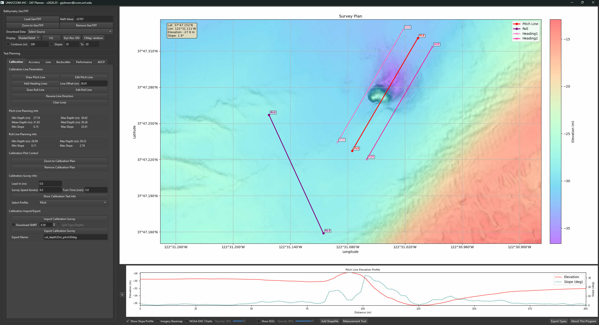

# SAT/QAT Planner



A comprehensive Shipboard Acceptance Testing (SAT) and Quality Assurance Testing (QAT) planning tool with GeoTIFF support, built with PyQt6.

## Overview

The SAT/QAT Planner is a desktop application designed for planning and visualizing multibeam testing and calibration operations. It supports six main planning modes:
- **Calibration Survey Planning**: Plan pitch, roll, and heading calibration lines
- **Accuracy Survey Planning**: Generate parallel survey lines with customizable parameters
- **Line Planning**: Interactive line drawing with real-time elevation profiles
- **Backscatter Normalization Planning**: Interactive line and area selection for backscatter calibration
- **Performance (Swath) Survey Planning**: Plan a four-heading swath performance test with optional RX-noise BIST legs relative to swell direction
- **ADCP Calibration Planning**: Plan dual-circle ADCP calibration tracks with segment-based profiles and import/export

## Features

### Core Functionality
- **Multi-tab Interface**: Calibration, Accuracy, Line, Backscatter, Performance, and ADCP tabs (left panel)
- **Shared Import/Export**: A single **Import/Export** group above the tab notebook; **Import Survey** / **Export Survey** labels and the **Export Name** field follow the active tab
- **Dark Theme**: Qt GUI always uses a dark theme; map (matplotlib) keeps default styling
- **Startup Guidance**: The map and profile plots show *Load a Test Plan or Bathymetry to begin planning* until bathymetry or survey geometry is loaded
- **GeoTIFF Support**: Load and visualize elevation data from GeoTIFF files
- **Download Online Bathymetry**: **Download Online Bathymetry** in the Bathymetry GeoTIFF panel opens an interactive dialog (GEBCO 2026, GMRT Topo-Bathy / Observed Only, NCEI multibeam mosaics, WGOM-LI-SNE) with map preview, AOI selection, and GeoTIFF download into the planner
- **GMRT on Import**: After you **select a survey file**, if the import has **no planning bathymetry** (no `geotiff_path` in metadata, or the saved file is missing), a dialog offers **GMRT download** for the survey area (**Cell Size** 60/120/240/480/960 m matching Download Bathymetry, default **60 m**; buffer; optional Split Topo/Depths). If bathymetry was loaded from the survey, the dialog is skipped. While a download is in flight, **Import Survey** turns orange as **Downloading GMRT - Click to Cancel**; clicking again cancels the worker, removes any partial file, and restores the button
- **Map Display** / **Color Map**: Display mode dropdown and colormap cycle button remain in the Bathymetry GeoTIFF panel; **Vertical Exaggeration** and **Dyn Res** live in **Map Options**
- **Map Options** (icon, lower-left of the map): Non-modal dialog for Imagery Basemap, NOAA ENC + opacity, EEZs + opacity, Add/Remove Shapefile, Vertical Exaggeration, Dyn Res, Contours, and multi-range Slopes overlay (Qt overlay icons are not included in exported map PNGs)
- **Measurement Tool** (icon to the right of Map Options): Toggle distance/heading measure mode; orange thick `+` cursor while active; bottom-strip prompt explains how to deactivate
- **Interactive Plotting**: Pan (middle mouse), zoom (scroll), and interact with survey plans on the map (no toolbar)
- **Real-time Statistics**: Calculate survey distances, times, and comprehensive statistics
- **Elevation Profiles**: View elevation and slope profiles for drawn lines; **Show Slope Profile** checkbox on the bottom strip (right side, next to About)
- **Activity Log**: Collapsible side panel below the map (expand/collapse strip)
- **Export Capabilities**: Export survey plans in CSV, Shapefile, GeoJSON, asciiplan, LNW, PNG (high and/or low resolution), and companion text/statistics formats (varies by tab)
- **Export Name**: Suggested basenames update automatically when blank or still matching the auto-generated pattern; **custom Export Names are preserved** and are not overwritten on Enter/blur or when plan parameters regenerate (Accuracy, Performance, Calibration, ADCP, Backscatter)
- **Export Types**: Opened from the **Select Export Directory** dialog (Action button); toggle optional export products by format; choices are saved in `~/.cal_ref_planner_config.json` under `export_type_options`
- **Survey Import**: Use the shared **Import Survey** control (label follows the active tab). Import calibration, accuracy, performance, line, backscatter, and ADCP plans from DDD, DMS, DMM, LNW, CSV, GeoJSON, GPX, shapefile (`.shp`), or GeoPackage (`.gpkg`) (calibration, accuracy, and performance imports use an assignment dialog when geometry is ambiguous; shapefile/GPKG geometry is reprojected from its source CRS to WGS84 automatically). **GMRT bathymetry** is offered **after** file selection when no planning GeoTIFF is available (if a grid is already loaded, choose **Keep existing grid** or **Download new GMRT grid**). The prompt lets you choose **Cell Size (m)** (same GMRT presets as Download Bathymetry: 60/120/240/480/960, default **60**), a **Degrees** buffer (fixed box around survey center) or **Percent of survey** buffer (expand the visible map-frame bounds; default **20%**); cell size, buffer mode, and amounts are remembered in `gmrt_import_options`
- **EEZ Overlay**: EEZ layer with opacity control (default 80%) and hover `GEONAME` tooltip lookup (controls in Map Options)
- **Visualization Shapefile Toggle**: `Add Shapefile` / `Remove Shapefile` in Map Options after loading, allowing quick removal of visualization overlays

### Calibration Survey Planning
- Draw pitch and roll calibration lines interactively
- Generate heading calibration lines from pitch line
- **Reverse Line Direction**: Flip start/end of any calibration line(s) (Pitch, Roll, Heading1, Heading2) via checkboxes
- **Lead-In (m)** parameter (default `0`) adds calibration run extensions:
  - Pitch: `PLLI` (lead-in), `PLLO` (lead-out)
  - Roll: `RLLI` (lead-in), `RLLO` (lead-out)
  - Heading 1: `H1LI` (lead-in only), Heading 2: `H2LI` (lead-in only)
- Lead-in/out segments are plotted in calibration colors with **dashed** style; main calibration lines remain **solid**; lead segments are excluded from legend entries
- If a calibration line is reversed, lead-in stays with line start and lead-out (Pitch/Roll) stays with line end
- **Line Offset (m)** (the perpendicular distance between the pitch line and each heading line): When drawing, the field is filled with the median GeoTIFF depth along the pitch line (recommendation mode). When importing a plan that already contains heading lines, the field is filled with the actual perpendicular distance from the pitch line to the imported heading lines (computed with `pyproj.Geod`) and **locked** so a subsequent GeoTIFF / GMRT load doesn't overwrite it. Sidecar `line_offset` in a `*_params.json` still wins over both. The lock releases when the user picks a new pitch line, edits the existing pitch line, or starts a fresh calibration survey, at which point depth-driven recommendation resumes.
- Display pitch line depth statistics (shallowest, maximum, mean, median)
- Configure turn time for accurate time estimates
- Import calibration surveys (DDD/DMS/DMM/LNW, CSV, GeoJSON, Shapefile `.shp`, GeoPackage `.gpkg`); **suggested line assignment** from file labels or geometry (Pitch = middle parallel line, Roll = non-parallel, Heading1/2 by file order); **GMRT download offered after import** when no planning GeoTIFF is present
- GeoJSON import loads geometry from **`{name}.geojson`**; **`{name}_params.json`** in the same folder (if present) supplies **survey speed**, **turn time (min)**, **lead-in (m)**, **heading line offset**, and **export name** so you can edit those fields without changing the geometry file
- Import auto-zooms to the extents of all loaded calibration geometry, including lead-in/out when present
- **Calibration Survey Info** dialog and *_info.txt with **Calibration Waypoints (DMM)** and **Calibration Waypoints (DDD)** sections (including core start/end waypoints and lead waypoints when lead-in is nonzero)
- **Calibration Survey Info** / `*_info.txt` timing includes lead distance; for Pitch/Roll reciprocal runs, per-pass timing is `lead-in + main line` (far-end lead-out is treated as the reciprocal lead-in)
- Comprehensive statistics with survey time, transit time, and turn time breakdowns
- Validation warning when heading line offset exceeds 2x shallowest depth
- Export calibration survey plans with detailed statistics (shared DDD/DMM/DMS CSV and TXT, asciiplan, LNW via `sat_planner.export_utils`)
- Default **Export Name** format: `cal_depth<m>m_pitch<deg>deg`; custom names are preserved when the pitch line / offset updates

### Accuracy Survey Planning
- Generate parallel survey lines with customizable parameters
- Auto-regenerate plans when parameters change (with debounce)
- Configure line length, spacing, heading, speed, and turn time
- Import accuracy surveys (DDD/DMS/DMM/LNW, CSV, GeoJSON, Shapefile `.shp`, GeoPackage `.gpkg`); **suggested crossline and reference line order** (crossline by orientation, reference lines in file order); **GMRT download offered after import** when no planning GeoTIFF is present
- **Accuracy Survey Info** dialog and *_info.txt with **Survey Plan** and **Export Date**, crossline depth/slope extrema (minimum/maximum depth and slope from the full crossline profile), and **Accuracy Waypoints (DMM)** / **Accuracy Waypoints (DDD)** sections (L1S/L1E, L2S/L2E, …, CLS/CLE)
- `*_info.txt` for Accuracy now uses the same base text content as **Accuracy Survey Info** (with export-only degree-symbol normalization)
- Calculate comprehensive survey statistics with time breakdowns
- Survey time breakdown showing main lines, crossline, transit, and turn times
- Export accuracy survey plans with detailed statistics (shared DDD/DMM/DMS CSV and TXT, asciiplan, LNW via `sat_planner.export_utils`)
- Default **Export Name** format: `acc_depth<m>m_cross<deg>deg`; a typed custom name is kept unless Reset clears the plan

### Performance (Swath) Survey Planning
- **Purpose**: Support **swath performance** evaluation with **four legs** on headings **0°, 45°, 90°, and 135° relative to swell direction** (different aspects into/across/with/oblique to the seas). Each leg combines **swath collection** along the main segment (P1S–P4E) with **RX noise BIST** on the map extension from each line end when BIST time is non-zero.
- **Parameters**: Central lat/lon (**Pick Center from GeoTIFF** on Performance), **Swell Direction** (default **0°**), swath angle, sound velocity, test depth, pings, test speed, BIST time, turn time; **Line Length (m)** from speed and along-track collection time.
- **Plot Performance Lines** plus a dedicated **Performance Plot Control** group (`Zoom to Performance Lines`, `Remove Performance Lines`); **Show Performance Test Info** (pattern, legs, transits, times, waypoints DMM/DDD). Exported performance `*_info.txt` uses the same detailed content and includes **Performance Survey** and **Export Date** at the top.
- In **Calculated Time & Distance**, total test time is shown on one line (`min` + `hr`) and line length is shown on one line (`m`, `km`, `nm`)
- **Auto-plot** (debounced) after editing test parameters or after performance pick-center when inputs are valid.
- **Profile** (Performance tab): line 1 swath + first BIST segment; **sienna** / **gold** to match the map.
- **Performance Import/Export**: same product family as Accuracy exports plus `{name}_performance_params.json`; **GMRT download offered after import** when no planning GeoTIFF is present; assignment dialog when import geometry is ambiguous. Default export basename: `perf_swell<deg>_depth<m>m` (custom Export Names are preserved)
- **Map markers**: **Perf Central Pt** vs **Acc Central Pt** (green accuracy center only when an accuracy plan is loaded).

### Line Planning
- Interactive line drawing with waypoint support
- **Reverse Line Direction**: Flip start and end of the line (one click)
- Real-time elevation profiles as you draw
- Edit existing lines by dragging waypoints
- Import/export line plans (DDD, DMS, DMM, LNW, CSV, GeoJSON, Shapefile `.shp`, GeoPackage `.gpkg`; single polyline, no assignment dialog)
- **GMRT download offered after import** when no planning GeoTIFF is present
- **Survey Info** dialog and *_info.txt with **Line Plan Waypoints (DMM)** and **Line Plan Waypoints (DDD)** sections (WP1, WP2, …)
- Calculate survey statistics for drawn lines
- Export uses shared DDD/DMM/DMS CSV and TXT, asciiplan, LNW via `sat_planner.export_utils`
- Line export writes `*_params.json` including line survey speed, GeoTIFF path, visualization shapefile path list, and optional **`vert_exag_table`** / **`shaded_relief_cmap`** / **`slope_overlay_bands`** / **`slope_overlay_opacity`**

### Backscatter Normalization Planning
- Dedicated **Backscatter** tab with criteria controls and a line/area planning workflow
- Optional **Load Backscatter GeoTIFF** and **Show Backscatter Grid** overlay (resampled to current bathymetry grid/extent)
- **Show Normalization Areas** overlay based on slope-band filtering with configurable color/opacity
- Optional filters for depth range, minimum connected area, minimum feature width/height, and percentile clipping
- **Backscatter Line Planning** (group **Line/Area Info**): **Select Area/Line**, **Move Waypoints** (drag centerline endpoints `BS1S`/`BS1E` while preserving area half-width), **Clear Area/Line**, **Edit Area Width**, **Show Area Stats**; **Box Width (m)** field (debounced) syncs with geometry and can set normalization width (`half_width = width / 2`)
- Centerline with lead-in/lead-out and area width planning; map labels include `BS1LI`, `BS1S`, `BS1E`, `BS1LO`
- **Show Area Stats** and **Survey Info** / `*_info.txt` include line/area metrics, **Normalization Area Width** (full width = `2 × half_width_m`), and waypoint sections in DMM/DDD
- Import/export backscatter line products (respects **Export Types** toggles, including map/profile PNG high and low); exports include `{name}_backscatter_stats.png` (+ optional `*_low` copy) when map PNG export is enabled
- Default **Export Name** format: `BS_YYYYMMDD_<mean depth>`; custom names are preserved when geometry regenerates the suggested name
- Optional GMRT download offered after import when no planning GeoTIFF is present

### ADCP Calibration Planning
- **ADCP** tab: dual-circle calibration tracks (36 segments per circle), diameter/speed/turn-time parameters, and map markers for circle centers and travel direction
- **ADCP Plot Control**: Zoom to plan, show direction of travel, clear plan, **Show ADCP Cal Info**
- Import/export ADCP calibration (same survey file families as other tabs where applicable); `{name}_adcp_params.json` sidecar; **GMRT download offered after import** when no planning GeoTIFF is present
- Elevation profile follows circle segments when bathymetry is loaded

### GeoTIFF Visualization
- **Map Display** modes (dropdown in Bathymetry GeoTIFF): **Shaded Relief** (default), **Shaded Slope**, **Hillshade**, **Slope**
- **Shaded Relief**: Multidirectional hillshade underlay plus semi-transparent elevation color overlay (default colormap **rainbow**); uses the **dynamic vertical exaggeration** curve (`shaded_relief_dyn` column)
- **Shaded Slope** / **Hillshade**: Same dynamic vertical exaggeration curve as Shaded Relief for hillshade rendering; Shaded Slope adds a slope-degree overlay
- **Color Map** button: Cycles the Shaded Relief elevation overlay colormap through rainbow, viridis, cividis, turbo, CnBu (inverted), Greys (inverted), ice / arctic / sapphire / torch (when the optional `colormaps` package is installed), RdYlBu (inverted), Spectral (inverted), hsv (inverted), jet, and winter; choice is saved between sessions and in survey `*_params.json`
- **Map Options** dialog (map icon):
  - **Vertical Exaggeration**: Opens the breakpoint table (**Shaded Relief** values; **Shaded Relief Dyn** auto-derived); **Reset to Defaults** restores built-in breakpoints; saved in config and `*_params.json`
  - **Dyn Res: ON/OFF**: Toggle dynamic resolution loading for performance
  - **Contours (m)** and interval
  - **Slopes**: Up to **three slope ranges**, each with min/max (degrees), color swatch, and a shared opacity slider (default 40%). Use **`-`** for min and/or max to leave a range undefined (it is not drawn); tooltip on the fields explains this. Defaults: Range 1 = 10–20° green; Ranges 2–3 = undefined with dodgerblue / orangered. Bands, colors, and opacity persist between sessions and in `*_params.json` (import overrides session values)
- Hillshade rendering for better terrain visualization
- Support for various coordinate reference systems (CRS)
- Survey plan axis labels in degrees–decimal minutes (DDM)
- Contour interval and slope min/max entry updates are debounced while typing
- Survey legend is drawn above map overlays/layers
- EEZ overlay reloads on pan/zoom and supports paused-hover name lookup

### GeoJSON metadata (and sidecar JSON)
- **All survey `*_params.json` sidecars** (Calibration, Accuracy, Line, Backscatter, Performance, ADCP as applicable) may include **`vert_exag_table`**, **`shaded_relief_cmap`**, **`slope_overlay_bands`**, and **`slope_overlay_opacity`** so hillshade V.E., Shaded Relief colormap, and slope-overlay settings travel with the survey on export/import.
- **Calibration**: GeoJSON holds line geometry and `line_num` / `line_name` only. The FeatureCollection **`properties`** may include **`geotiff_path`** so a saved raster can be reopened on import. **Survey speed**, **turn time (min)**, **lead-in (m)**, **heading line offset**, and **export name** live in **`{export_name}_params.json`** next to the GeoJSON (not in the `.geojson`). On import, that sidecar is optional; if it is absent, the app uses defaults and may repopulate the heading offset from the pitch line after load.
- **Accuracy**: GeoJSON exports include **`survey_speed`**; saved raster path is stored in **`{export_name}_params.json`** as **`geotiff_path`**.
- **Line** GeoJSON exports can include **`survey_speed`** and **`geotiff_path`** (collection and/or feature properties as applicable).
- **Backscatter** exports include line GeoJSON and optional normalization area polygon GeoJSON (`{name}_area.geojson`) plus `{name}_params.json` with backscatter planning and filter settings; import restores these when present.
- **Performance** GeoJSON uses feature properties such as **`line_num`** (1–4 for swath legs, 11–14 for BIST extensions where applicable) and may include speed-related keys; full test parameters are also in **`{name}_performance_params.json`** (including **`swell_direction_deg`**, restored on import when the sidecar is present).
- Whenever a saved **GeoTIFF** path is present in the imported files, SAT Planner tries to open it; if the file is missing, import continues with a warning.

## Requirements

### Python Version
- Python 3.7 or higher

### Core Dependencies
- PyQt6
- matplotlib
- numpy

### Geospatial Dependencies (Required for GeoTIFF support)
- rasterio
- pyproj
- shapely
- fiona

### Optional
- **Pillow (PIL)** – Imagery Basemap and NOAA ENC Charts overlays; preferred path for resizing exported `*_low.png` email copies
- **requests** – Online bathymetry download (Download Online Bathymetry dialog) and GMRT post-import download
- **colormaps** – Extra Shaded Relief colormaps (ice, arctic, sapphire, torch); without it those options are omitted from the Color Map cycle

## Project structure

The application is organized as a package plus a launcher:

- **`SAT_Planner_PyQt.py`** – Entry point; creates the main window and runs the app (`python SAT_Planner_PyQt.py`).
- **`sat_planner/`** – Core package:
  - **`constants.py`** – Version, config path, geospatial library availability, Shaded Relief colormap options, default slope-overlay bands.
  - **`export_utils.py`** – Shared export writers: DDD/DMM/DMS CSV and TXT, SIS asciiplan, Hypack LNW; UTM zone from points; PNG helpers (`save_export_png`, `*_low.png` email copies).
  - **`performance_import_dialog.py`** – Assignment dialog for mapping imported segments to Performance swath lines 1–4 and optional BIST 1–4.
  - **`import_survey_dialog.py`** – Post-import GMRT bathymetry prompt when a survey has no planning GeoTIFF.
  - **`dyn_vert_exag_dialog.py`** – Dialog for editing dynamic vertical exaggeration breakpoint tables (Map Options → Vertical Exaggeration).
  - **`map_options_dialog.py`** – Non-modal Map Options dialog (layers, V.E., Dyn Res, contours, slope ranges).
  - **`utils_geo.py`** – Coordinate helpers (e.g. decimal degrees to DDM).
  - **`utils_ui.py`** – UI helpers (message boxes, confirmations).
  - **`bathymetry_download/`** – Interactive **Download Online Bathymetry** dialog (map preview, AOI, multi-source download workers; vendored from Bathymetry Downloader).
  - **`gmrt_dialog/`** – Legacy embedded GMRT Grid dialog (retained for shared split logic); primary bathymetry UI is `bathymetry_download/`.
  - **`gmrt_split.py`** – Split combined GMRT GeoTIFF into topo/bathy grids (used by import GMRT and download flows).
  - **`mixins/`** – Feature mixins used by the main window:
    - **BasemapMixin** – Imagery basemap and NOAA ENC Charts overlays.
    - **GeoTIFFMixin** – Load/remove GeoTIFF, display mode, dynamic resolution, contours, slope-overlay bands/opacity.
    - **PlottingMixin** – Survey plan plot, limits, colorbars, DDM axis labels.
    - **SurveyParsersMixin** – DDD/DMS/DMM/LNW parsers (lines and polylines), UTM zone dialog.
    - **GMRTDownloadMixin** – GMRT GridServer download and load GeoTIFF (post-import prompt and download flows).
    - **ReferenceMixin** – Accuracy tab (reference/survey line planning), export/import.
    - **CalibrationMixin** – Calibration tab, pitch/roll/heading lines, export/import.
    - **LinePlanningMixin** – Line planning tab, draw/edit, profile, statistics.
    - **PerformanceMixin** – Performance tab: ping/line-length math, pick center/depth, plot/info, import/export hooks, debounced auto-plot.
    - **AdcpMixin** – ADCP tab: dual-circle calibration, import/export, profiles.
    - **ProfilesMixin** – Crossline, pitch, line-planning, backscatter, performance, and ADCP elevation profiles.
    - **MapInteractionMixin** – Click, scroll, pan, zoom, pick center/pitch/roll, measurement tool.
    - **ExportImportMixin** – Shared Import/Export UI, save/load parameters, export survey files, **Select Export Directory** dialog with **Export Types** button, post-import GMRT prompt.
    - **ConfigMixin** – Last-used directories, config load/save, persisted **Export Types** options, **`vert_exag_table`**, **`shaded_relief_cmap`**, **`slope_overlay_bands`**, and **`slope_overlay_opacity`** (with migration from legacy `map_png` / `profiles_png` keys).

## Installation

### Option 1: Using Pre-built Executable

Download the latest executable from the [Releases](https://github.com/seamapper/SAT_Planner/releases) page:
- `SAT_Planner_v2026.39.exe` (Windows) or newer — version is in the filename (see `sat_planner/constants.py`).
- `SAT_Planner.app` (macOS) — if available

No installation required - just run the executable or app bundle.

### Option 2: From Source

1. Clone the repository:
```bash
git clone https://github.com/seamapper/SAT_Planner.git
cd SAT_Planner
```

2. Install dependencies:

**Using pip:**
```bash
pip install PyQt6 matplotlib numpy rasterio pyproj shapely fiona Pillow requests colormaps
```
(`requests` is used for online bathymetry and GMRT downloads; `colormaps` is optional for ice/arctic/sapphire/torch.)

**Using conda (recommended for Windows and macOS):**
```bash
conda install -c conda-forge pyqt matplotlib numpy rasterio pyproj shapely fiona pillow
pip install requests colormaps
```

3. Run the application:
```bash
python SAT_Planner_PyQt.py
```

## Building from Source

### Building for Windows

1. Install PyInstaller:
```bash
pip install pyinstaller
```

2. Run the build script (edit `build_exe.bat` to set `PYTHON_PATH` if needed):
```bash
build_exe.bat
```

Or build manually: `pyinstaller SAT_Planner.spec`. The executable is created in `dist` as `SAT_Planner_v<version>.exe` (version from `sat_planner/constants.py`).

### Building for macOS

To build a macOS application (.app bundle), create a PyInstaller spec (one-file or one-folder) that includes the `sat_planner` package and `SAT_Planner_PyQt.py` as the entry point. If a macOS spec file is present in the repo (e.g. `Sat_Planner_macOS.spec`), run:

```bash
pip install pyinstaller
pyinstaller Sat_Planner_macOS.spec
```

Use `.icns` for the app icon (convert `media/CCOM.ico` with `sips -s format icns media/CCOM.ico --out media/CCOM.icns` if needed). The app bundle will be in `dist/`. Code signing and DMG packaging are optional for distribution.

## Usage

### Basic Workflow

1. **Load bathymetry** (optional): Click **Load GeoTIFF**, or **Download Online Bathymetry** to fetch a grid (GEBCO, GMRT, NCEI, WGOM, etc.) and load it into the planner. Until bathymetry or a survey plan is loaded, the map and profile show a short *Load a Test Plan or Bathymetry to begin planning* message.
2. **GeoTIFF display** (optional): Use **Map Display** (Shaded Relief, Shaded Slope, Hillshade, Slope) and **Color Map** in the Bathymetry GeoTIFF panel; open **Map Options** (map icon) for Vertical Exaggeration, Dyn Res, Contours, and Slopes
3. **Map overlays / measure** (optional): Use **Map Options** for Imagery Basemap, NOAA ENC, EEZs, and shapefiles; use the **Measurement** icon for distance/heading
4. **Select Planning Mode**: Choose Calibration, Accuracy, Line, Backscatter, Performance, or ADCP
5. **Configure Parameters**: Set survey parameters in the appropriate tab
6. **Generate/Plan** or **Import Survey**: Create survey lines from parameters, draw interactively, or use the shared **Import Survey** button (label follows the active tab). If the imported survey has no planning GeoTIFF, you will be prompted to download GMRT for the survey area.
7. **View Statistics / test info**: Open the tab’s survey-info dialog (Calibration, Accuracy, Performance, Line, Backscatter, or ADCP)
8. **Export**: Use **Export Survey**; in **Select Export Directory**, use **Export Types** if you want to limit optional formats (shapefile, text, Hypack, GPX, PNG resolutions, etc.)

### Calibration Survey Planning

1. Load a GeoTIFF (recommended)
2. Click "Draw Pitch Line" and click start/end points on the map
3. Configure `Lead-In (m)` in Calibration Survey Info (default: `0`) and Turn Time (min) (default: `5`)
4. Click "Add Heading Lines" to generate heading calibration lines (warning shown if offset > 2x shallowest depth)
5. Click "Draw Roll Line" and click start/end points
6. Use "Show Calibration Test Info" to review comprehensive statistics including lead-adjusted timing
7. Export as needed (statistics file includes all details from dialog)

### Accuracy Survey Planning

1. Optionally load a GeoTIFF and pick a center point (view stays at current zoom)
2. Enter survey parameters:
   - Central Latitude/Longitude
   - Number of Lines
   - Line Length
   - Heading
   - Distance Between Lines
   - Survey Speed
   - Turn Time (min) - default: 5 minutes
3. The plan auto-regenerates as you change parameters
4. View comprehensive statistics with survey time, transit time, and turn time breakdowns
5. Export the plan

### Performance (Swath) Survey Planning

1. Load a GeoTIFF (needed for plotting and for depth at pick).
2. Open the **Performance** tab; set **Swell Direction** (default 0°) and other test parameters (speed, pings, BIST time, etc.).
3. Use **Pick Center from GeoTIFF** and click the map, or enter central latitude/longitude manually. With valid depth/speed/pings, the plan may **auto-plot**; otherwise click **Plot Performance Lines**.
4. Use **Show Performance Test Info** for a written pattern, distances, and times; use the shared **Import Survey** / **Export Survey** controls to share plans in the same family of formats as Accuracy.

### Line Planning

1. Load a GeoTIFF (recommended)
2. Click "Start Drawing Line"
3. Left-click to add waypoints
4. Right-click to finish the line
5. Edit by clicking "Edit Line Planning" and dragging waypoints
6. View elevation profile and statistics
7. Export the line plan

### Backscatter Normalization Planning

1. (Optional) Load bathymetry GeoTIFF and then load a backscatter GeoTIFF.
2. Enable/adjust **Show Normalization Areas** criteria (slope band and optional depth/area/extent filters).
3. In **Backscatter Line Planning**, define the normalization centerline/area and line settings (lead-in, speed, swath angle, sound velocity).
4. Use **Show Area Stats** and **Survey Info** to review calculated metrics and waypoints (`BS1LI`, `BS1S`, `BS1E`, `BS1LO`).
5. Adjust **Box Width (m)** or use **Edit Area Width** / **Move Waypoints** as needed.
6. Use **Import Survey** / **Export Survey** (Backscatter labels when that tab is active) to share geometry, settings, and reports (optional products follow **Export Types**).

### ADCP Calibration Planning

1. Load bathymetry (recommended).
2. Open the **ADCP** tab; set circle diameter, survey speed, turn time, and related parameters.
3. Place or import the dual-circle calibration plan; use **Zoom to ADCP Cal** and **Show ADCP Cal Info** as needed.
4. Use **Import Survey** / **Export Survey** to share geometry and `{name}_adcp_params.json` metadata.

### Download Online Bathymetry

Click **Download Online Bathymetry** in the **Bathymetry GeoTIFF** panel to open the interactive download dialog. Sources include:

- **GMRT Topo-Bathy** (default) and **GMRT Topo-Bathy (Observed Only)**
- **GEBCO 2026**
- **NCEI Multibeam Mosaic** (Raw and Proc)
- **WGOM-LI-SNE** (Hi Resolution and Regional)

In the dialog you can:

- Preview the selected source on the map (including optional GMRT hi-res mask)
- Set the area of interest (coordinates or map draw)
- Choose cell size / resolution where the source supports it (meter presets for GMRT and WGOM)
- Download a GeoTIFF; on success the grid is loaded into SAT Planner

GMRT sources support optional **Split Topo/Depths** (load bathymetry only). Large GMRT requests may warn when estimated pixels exceed limits.

### Legacy Download GMRT Grid Dialog

The older standalone **Download GMRT Grid** window (`sat_planner/gmrt_dialog/`) remains in the codebase for shared GMRT split logic. The main application UI uses **Download Online Bathymetry** instead. If you open the legacy dialog directly, you can:

- Set the area of interest (North/South/East/West or draw on the map)
- Choose **Cell Resolution**: 100 m, 200 m, 400 m, or **Custom** (e.g. 50 m); default is 100 m
- **Split Grid Into Bathymetry and Topography** is enabled by default; SAT Planner loads the bathymetry grid after download
- A warning (orange text) appears when estimated pixels exceed 16,000,000
- Download progress displays in-dialog (tile mode: `x of y`; single-grid mode: indeterminate "Downloading...")

Downloads are always GeoTIFF. The legacy dialog uses its own config: `~/.gmrtgrab_sat_planner_config.json`.

### Map Options and Measurement

Map controls sit as **Qt icons on the lower-left of the map** (not drawn into export PNGs):

1. **Map Options** (`options_off.png` / `options_on.png` while the dialog is open): Non-modal dialog with:
   - **Imagery Basemap**, **NOAA ENC Charts** (+ opacity), **Show EEZs** (+ opacity), **Add/Remove Shapefile**
   - **Vertical Exaggeration** and **Dyn Res**
   - **Contours (m)** and **Slopes** (three ranges + shared opacity)
   - Basemap/ENC/EEZ layers update as you pan and zoom; large-area views use wrap-aware basemap alignment

2. **Measurement Tool** (`dh_t_off.png` / `dh_t_on.png` when active): Click two points for distance and heading; orange thick `+` cursor while measuring. Click the icon again to deactivate (prompt on the bottom strip while active).

Bottom strip (under the profile): left-side prompts (e.g. measurement active), **Show Slope Profile**, **About This Program**.

## Configuration

The application saves configuration in:
- `~/.cal_ref_planner_config.json` (user preferences), including:
  - Last used directories
  - **`export_type_options`**: per-format export toggles (`esri_shapefile`, `gpkg`, `sis_asciiplan`, `gpx`, `text_csv`, `text_txt`, `hypack_lnw`, `map_png_high`, `map_png_low`, `profiles_png_high`, `profiles_png_low`, `geotiff_full`, `geotiff_view`; most default **on**, `gpkg` / `geotiff_full` / `geotiff_view` default **off**; Full and View are mutually exclusive)
  - **`gmrt_import_options`**: post-import GMRT prompt settings (`download`, `cell_size_m` = 60|120|240|480|960 default **60**, `buffer_mode` = `degrees`|`percent` default **percent**, `buffer_deg` default **0.5**, `buffer_percent` default **20** applied to the visible map-frame extent, `split_topo_depths`)
  - **`vert_exag_table`**: Shaded Relief dynamic vertical exaggeration breakpoints (elevation range minima and **Shaded Relief** / **Shaded Relief Dyn** values); default breakpoints 0, 20, 50, 200, 1000 m
  - **`shaded_relief_cmap`**: Last selected Shaded Relief elevation overlay colormap (default **rainbow**)
  - **`slope_overlay_bands`**: Three slope-overlay ranges (min/max degrees or null, color hex)
  - **`slope_overlay_opacity`**: Slope overlay opacity percent (default **40**)
  - Other saved UI/planning preferences as applicable

Survey **`{name}_params.json`** sidecars (and tab-specific variants such as `{name}_performance_params.json`, `{name}_adcp_params.json`) also store **`vert_exag_table`**, **`shaded_relief_cmap`**, **`slope_overlay_bands`**, and **`slope_overlay_opacity`** when exported, and restore them on import when present (params values override the session config).

## Export Formats

### Always exported
Regardless of **Export Types** settings (Accuracy, Calibration, Performance, Line, Backscatter, and ADCP):
- **GeoJSON** (and backscatter `{name}_area.geojson` when a normalization polygon exists)
- **`{name}_params.json`** sidecars (tab-specific fields; Performance uses `{name}_performance_params.json`)
- **`*_info.txt`** statistics / survey-info reports

### Optional (controlled by Export Types)
In the **Select Export Directory** dialog, click **Export Types** to enable or disable:

| Toggle | Product |
|--------|---------|
| ESRI Shapefile | `.shp` (+ sidecars) |
| GeoPackage | `.gpkg` (default off) |
| SIS ASCIIplan | asciiplan file |
| GPX | `.gpx` (and per-test GPX where applicable) |
| Text (.csv) | DDD, DMM, DMS CSV |
| Text (.txt) | DDD, DMM, DMS TXT |
| Hypack (.lnw) | LNW (UTM zone from survey points) |
| Map PNG — high resolution | `{name}_map.png` at 300 dpi |
| Map PNG — low resolution (email) | `{name}_map_low.png` (longest side ≤ 1280 px; uses Pillow when available) |
| Profiles PNG — high resolution | Profile PNG(s) at 300 dpi (naming varies by tab, e.g. `{name}_profile.png`, `{name}_profiles.png`, `{name}_pitch_profile.png`, crossline/main-line profiles on Accuracy) |
| Profiles PNG — low resolution (email) | Matching `*_low.png` copies |
| GeoTIFF (Full) | Copy of the loaded planning GeoTIFF (`{name}_{cell}m_Full[_SOURCE].tif`); either/or with View; default off |
| GeoTIFF (View) | Crop of the loaded GeoTIFF to the current map view plus a 10% wider/taller buffer, clipped to the source grid (`{name}_{cell}m_View[_SOURCE].tif`); either/or with Full; default off |

Backscatter **map** PNG toggles also control `{name}_backscatter_stats.png` (+ optional `*_backscatter_stats_low.png`). Legacy configs that only stored `map_png` / `profiles_png` are migrated to set both high and low to the former value.

When **GeoTIFF (Full)** or **GeoTIFF (View)** writes a file, `geotiff_path` in `*_params.json` (and GeoJSON collection properties where present) points at that exported file; otherwise it points at the loaded planning GeoTIFF, or `null` if none is in use. If the GeoTIFF is in the same directory as the export package, `geotiff_path` is stored as a **relative filename** (basename only) so the folder can be moved as a unit; otherwise an absolute path is stored. On import, relative paths resolve against the survey/`*_params.json` directory; absolute paths that no longer exist also fall back to the same-directory basename. `cell` is the larger of X/Y pixel size as integer meters. Optional `_SOURCE` is `_GMRT`, `_GEBCO`, `_NCEI`, or `_CCOM` when the grid came from **Download Data** / post-import GMRT; omitted for **Load GeoTIFF** and other unknown origins.

### Other export notes
- **Export Name preservation**: Auto-suggested names update only when the field is blank or still matches a known auto pattern (e.g. `acc_depth…`, `perf_swell…`, `cal_depth…`, `ADCP_Cal_Circle…`, `BS_YYYYMMDD_…`). User-edited custom names are not reset on Enter/blur or when related plan parameters regenerate.
- **CSV (DDD/DMM/DMS)**: Row format: line number, line name, point label, lat, lon (decimal degrees in file; DMM/DMS writers convert as needed)
- **Calibration `{name}_params.json`**: **`survey_speed`**, **`turn_time`**, **`lead_in_m`**, **`line_offset`**, **`export_name`**, plus optional **`vert_exag_table`**, **`shaded_relief_cmap`**, **`slope_overlay_bands`**, **`slope_overlay_opacity`**
- **Accuracy `{name}_params.json`**: Includes **`geotiff_path`**, survey parameters, and optional viz keys above
- **Backscatter `{name}_params.json`**: Centerline, half-width, lead-in, line settings, filter/overlay settings, related paths, and optional viz keys above

## Navigation

### Mouse Controls (no toolbar)
- **Left Click**: Add waypoint (in drawing mode); pick points in calibration/reference/line modes
- **Right Click**: Finish drawing line
- **Middle Mouse Button**: Pan the map
- **Scroll Wheel**: Zoom in/out

## Troubleshooting

### GeoTIFF Loading Issues

- Ensure the GeoTIFF file is valid and not corrupted
- Check that the file uses a supported CRS
- Large files may take time to load - be patient
- Try enabling **Dyn Res** for better performance

### Import Errors

If you encounter `ModuleNotFoundError` for geospatial libraries:

1. **Install dependencies**: Run `pip install rasterio pyproj shapely fiona`
2. **Windows users**: Consider using conda or OSGeo4W for easier installation
3. **Check Python environment**: Ensure you're using the correct Python environment

### Application Runs Without GeoTIFF Support

The application will run with limited functionality if geospatial libraries aren't available:
- Basic survey planning still works
- GeoTIFF loading will be disabled
- A warning message will be displayed

### Performance Issues

- Large GeoTIFF files may cause slow loading
- Enable **Dyn Res** to improve performance
- Consider using smaller tiles or downsampled data
- Close other applications to free up memory

## Version History

- **v2026.43**: Portable `geotiff_path` in survey packages. When an exported GeoTIFF (or other planning raster) lives in the same directory as `*_params.json` / GeoJSON, the path is stored as a relative filename so the package can be moved; import resolves relative paths (and missing absolute paths) against the survey directory. Same treatment for `backscatter_geotiff_path` when applicable. Post-import GMRT prompt **Cell Size (m)** pulldown (60/120/240/480/960, default **60**) matching Download Bathymetry presets; selection persists in `gmrt_import_options`.
- **v2026.39**: **Shared Import/Export** group above the tab notebook (import/export labels and Export Name follow the active tab). **Download Online Bathymetry** replaces the GeoTIFF **Download Data** source dropdown (GEBCO, GMRT, NCEI, WGOM interactive dialog with map preview). **GMRT on import** runs **after** survey file selection and prompts only when no planning GeoTIFF is available (missing path or absent metadata). Map and profile **startup placeholders** (*Load a Test Plan or Bathymetry to begin planning*). Added `import_survey_dialog.py`, `bathymetry_download/` package, and ADCP tab documentation in README.
- **v2026.37**: Map chrome declutter. **Map Options** icon (lower-left of map) opens a non-modal dialog for basemap/ENC/EEZ/shapefile, **Vertical Exaggeration**, **Dyn Res**, Contours, and **Slopes** (three ranges with colors, shared opacity, `-` = undefined/off). **Measurement Tool** is a map icon with orange thick `+` cursor and bottom-strip deactivate prompt. Bathymetry panel keeps **Map Display** and **Color Map** (extra ice/arctic/sapphire/torch when `colormaps` is installed; RdYlBu inverted). **Export Types** moved into the **Select Export Directory** dialog. Slope overlay bands/opacity and colormap persist in config and `*_params.json`.
- **v2026.36**: Export Name fields no longer snap back to the default suggested basename after editing. **Accuracy** and **Performance** no longer regenerate the name on Enter/blur; **Calibration**, **ADCP**, and **Backscatter** keep custom names when pitch/offset, diameter, or geometry updates would previously overwrite them. Blank names and names that still match the auto-generated pattern continue to refresh as parameters change.
- **v2026.35**: GeoTIFF display and visualization controls. **Shaded Relief** is now the single elevation-overlay mode (former **Shaded Relief Dyn** behavior): dynamic V.E. curve with multidirectional hillshade and semi-transparent elevation colors. Display dropdown: Shaded Relief, Shaded Slope, Hillshade, Slope. New **V.E.** button opens an editable breakpoint table (elevation range minima and Shaded Relief values; Shaded Relief Dyn auto-derived); defaults and user edits persist in `~/.cal_ref_planner_config.json` and survey `*_params.json`. New **CMap** button cycles Shaded Relief elevation colormaps (rainbow default; viridis, cividis, turbo, inverted CnBu/Greys/Spectral/hsv, RdYlBu, jet, winter); colormap persists between sessions and in params sidecars. **Hillshade** and **Shaded Slope** hillshade layers use the same dynamic V.E. curve as Shaded Relief. **Dynamic Resolution** button label shortened to **Dyn Res:** ON/OFF; **V.E.** button uses compact fixed width.
- **v2026.31**: Calibration tab layout cleanup and post-import zoom fix. The pitch-line, heading-line, and roll-line controls in the Calibration parameter panel are now paired on three compact rows: **Draw Pitch Line** + **Edit Pitch Line** share a row at 50/50 width, **Add Heading Lines** + **Line Offset (m)** share the next row at 50/50, and **Draw Roll Line** + **Edit Roll Line** share the row below at 50/50. The `Heading Line Offset (m)` label was shortened to **`Line Offset (m)`** to match the more compact column. Button text in active modes was simplified: `Draw a Pitch Line` -> `Draw Pitch Line`, `Draw a Roll Line` -> `Draw Roll Line`, `Drawing Pitch Line: Click Start Point` -> `Left Click Pitch Start Point`, `Drawing Pitch Line: Click End Point` -> `Click Pitch End Point`, `Drawing Roll Line: Click Start Point` -> `Click Roll Line Start Point`, `Drawing Roll Line: Click End Point` -> `Click Roll Line End Point`, and the in-edit labels `Click to Stop Editing Pitch Line` / `Click to Stop Editing Roll Line` were both shortened to `Click to Stop Editing`. The Draw Pitch Line, Draw Roll Line, Edit Pitch Line, and Edit Roll Line buttons now share a single visual convention while their mode is active: orange + bold text (`rgb(255, 165, 0)`, `font-weight: bold`), reverting to the default stylesheet when the action completes or is cancelled. While Edit mode is active for either pitch or roll, the other "next logical action" buttons (e.g. Add Heading Lines / Draw Roll Line) have their orange + bold highlighting snapshotted and reset to neutral; on exit those snapshots are restored so the highlighting comes back exactly as it was. The post-import GMRT zoom now lands on the bounds of the imported plan instead of the bounds of the downloaded GMRT grid: `_load_geotiff_from_path` accepts `auto_zoom_to_geotiff=False`, the GMRT post-download callback uses it, and a new `_zoom_to_tab_plan(tab_index=...)` dispatcher routes to the per-tab zoom helper (Calibration -> `_zoom_to_any_lines`, Accuracy -> `_zoom_to_plan`, Line -> `_zoom_to_line`, Backscatter -> a new `_zoom_to_backscatter_line_or_area`, Performance -> `_zoom_to_performance_lines`). The tab that started the import is recorded when the download begins, so the right zoom still fires even if the user switches tabs while the download is running.
- **v2026.30**: GMRT-download UX and Calibration-import polish. When **Download GMRT** is enabled and an import-survey button kicks off a download, the per-tab import button now repaints in orange and changes its label to **"Downloading GMRT - Click to Cancel"** for the duration of the transfer; the button stays enabled, so a second click cancels the in-flight worker, deletes any partial GeoTIFF, and restores the button to its normal state. The same cancel/restore path runs on transport failures, with the user notified via popup. Calibration import now also sources the **Heading Line Offset** from the imported geometry: if the imported file contains a pitch line plus heading line(s) and no `line_offset` is supplied in a `*_params.json` sidecar, SAT Planner computes the perpendicular distance from the pitch line to the heading-line midpoints (via `pyproj.Geod`) and uses that value, "locking" the offset entry so a subsequent GeoTIFF or GMRT load does not overwrite it with the depth-driven recommendation. The export-name composer reads the locked value, so the suggested name becomes `Calibration_<actual_offset>m_<heading>deg` instead of `Calibration_0m_<heading>deg`. The lock releases automatically as soon as the user picks a new pitch line, edits an existing pitch line, or starts a fresh calibration, at which point the field returns to depth-based recommendation behavior; the Pitch Line Info depth labels are still refreshed from the GeoTIFF either way.
- **v2026.29**: Added **Shapefile (`.shp`) and GeoPackage (`.gpkg`)** as importable survey-plan formats on every tab (Calibration, Accuracy, Line, Backscatter, Performance). Calibration and Performance imports still require exactly 4 LineString features and route them through the existing line-assignment dialogs; Accuracy treats every LineString as an unassigned line and uses the existing Accuracy assignment dialog (crossline vs Accuracy Line *n*); Line Planning uses the first LineString as a polyline; Backscatter takes the first LineString or, if none is present, the outer ring of the first Polygon/MultiPolygon. Features are read through `fiona` and reprojected from the source CRS (`.prj`) to WGS84; a missing-sidecar shapefile (no `.shx`/`.dbf`) produces a clear error before opening. Sidecar `*_params.json` next to the imported file is still honored for parameter restore. Also added **GeoPackage (`.gpkg`)** as a new toggle in the **Export Type Options** dialog (off by default). When enabled, every export path that already writes an ESRI Shapefile (`*.shp`) also writes a `*.gpkg` companion using the same features, schema, and `EPSG:4326` CRS; the Backscatter normalization area polygon, when present, is written as `*_area.gpkg` alongside `*_area.shp`. Either format can be toggled on independently — turning the Shapefile option off and the GeoPackage option on yields a GeoPackage-only export.
- **v2026.28**: Added **Split Topo/Depths** checkbox next to **Download GMRT** + buffer on every tab (Calibration, Accuracy, Line, Backscatter, Performance), default on, greyed out when Download GMRT is unchecked. When on, the per-tab GMRT auto-download on import splits the GeoTIFF at 0 m into `<name>_topo.tif` (values >= 0) and `<name>_bathy.tif` (values < 0); SAT Planner loads only the bathymetry file and the combined file is removed. If the downloaded extent contains no bathymetry the user is warned and the downloaded GeoTIFF(s) are deleted. Splitter extracted to `sat_planner/gmrt_split.py` (shared with the standalone Download GMRT Grid dialog). LNW import now auto-detects the UTM zone from the filename (`*_UTM<zone><N|S>*` pattern); the UTM Zone dialog still appears pre-filled so users can confirm or override. The shared LNW parser no longer emits a calibration-specific "Expected 4 lines" warning when called from the Accuracy / Line / Backscatter / Performance imports; the 4-line check now lives in the calibration import path only. After importing a survey plan, the map auto-zooms to the bounds of the imported plan (Accuracy, Line, Performance; Calibration and Backscatter were already doing this). Accuracy default export basename changed from `Accuracy_<dist_between_lines>m_<heading>deg` to `Accuracy_<center_depth>m_<heading>deg`, where the depth is taken from **Pick Center from GeoTIFF** or from `central_point_depth_m` in an imported `*_params.json` (falls back to 0 m when unavailable).
- **v2026.27**: **Export Types** PNG options split into map/profile **high** and **low (email)** toggles (all default on). Exported PNGs write `*_low.png` companions (1280 px max dimension; Pillow preferred). **Calibration lead-in (m)** end-to-end (UI, map dashed segments, waypoints, timing, `{name}_params.json`, import/export). **Backscatter** UI: **Move Waypoints**, **Box Width (m)**, **Line/Area Info** layout, normalization area width in Survey Info / `*_info.txt`; backscatter export respects Export Types.
- **v2026.23**: Added persistent **Export Types** controls and applied format gating across Accuracy, Calibration, Performance, and Line exports. `Add Shapefile` now toggles to `Remove Shapefile` after load. Accuracy `*_info.txt` now reuses Accuracy Survey Info content (with export-specific degree-symbol cleanup). Performance tab UI updates: new **Performance Plot Control** groupbox, consolidated **Total Test Time** display (`min` + `hr`), and consolidated **Line Length** display (`m`, `km`, `nm`). Line export now writes `*_params.json` (line survey speed, GeoTIFF path, visualization shapefile paths).
- **v2026.22**: Accuracy Survey Info now shows **Survey Plan** and **Export Date** at the top and reports crossline full-profile extrema (minimum/maximum depth and slope). Accuracy export/import stores GeoTIFF path in **`{name}_params.json`** (not Accuracy GeoJSON) and restores it from sidecar metadata on import (with GeoJSON fallback for older files). Performance export default basename now uses **swell direction** (`Performance_<swell_direction>deg_<speed>_kts`). Performance `*_info.txt` now mirrors **Show Performance Test Info** content and includes **Performance Survey** + **Export Date** headers.
- **v2026.20**: README: document **calibration** export/import split—**`{name}_params.json`** holds survey speed, turn time, heading line offset, and export name; **calibration GeoJSON** is geometry plus line labels (and optional **`geotiff_path`** on the FeatureCollection). Clarified GeoJSON metadata behavior for Accuracy, Line, and Performance.
- **v2026.15**: **Performance (swath) survey planning** tab: four headings relative to swell, swath lines plus optional **RX noise BIST** extensions; **Plot Performance Lines**, zoom/remove, **Show Performance Test Info**; debounced **auto-plot** after parameter edits and after performance pick-center; profile for **line 1 + BIST** with map-matched colors; **Performance Import/Export** (same export family as Accuracy, assignment dialog on ambiguous import, optional GMRT on import); default swell direction **0°**; accuracy vs performance **central point** markers fixed so accuracy center shows only when an accuracy plan is present; UI labels (**Plot Performance Lines**, button layout). Added `performance_import_dialog.py` and **PerformanceMixin**; README updated for Performance workflow.
- **v2026.14**: Added GeoTIFF Controls **Download Data** source dropdown (`Select Source`, `GMRT`) that opens the source flow immediately and keeps selection after successful download. Added GMRT dialog download progress bar (`x of y` for tiled downloads, indeterminate for single download). Added EEZ pan/zoom-driven refresh, paused-hover EEZ `GEONAME` tooltip lookups (including without a loaded GeoTIFF), and default EEZ opacity 80%. Improved large-area/world-scale alignment for EEZ and Imagery Basemap overlays. Updated GMRT dialog so **Split Grid Into Bathymetry and Topography** is enabled by default. Fixed line-plan zoom GeoTIFF coverage refresh, line-plan profile refresh after import, and calibration Pitch Line Info refresh after survey import.
- **v2026.11**: UI and workflow updates. Accuracy tab naming in UI/docs (formerly Reference). Import/Export button labels updated (Import/Export Accuracy Survey, Import/Export Calibration Survey, Import/Export Line Survey) and reordered on tabs. "Download GMRT" defaults to unchecked and placement updated in import/export groups. Activity Log changed to collapsible side panel. GeoJSON export/import now includes `survey_speed` and saved `geotiff_path` for Calibration/Accuracy/Line; missing GeoTIFF path does not block import (warning + continue). Contour interval and slope min/max redraws are debounced while typing. Survey legend now draws above all overlays.
- **v2026.10**: Shared export utilities (`sat_planner/export_utils.py`): DDD/DMM/DMS CSV and TXT, SIS asciiplan, Hypack LNW; UTM zone from points. Calibration/Reference/Line planning use these writers. Calibration: **Reverse Line Direction** (Pitch/Roll/Heading1/Heading2); **import suggestion** from metadata (PLS/PLE, RLS/RLE, H1S/H1E, H2S/H2E) or geometry (Pitch = middle parallel, Roll = fourth line, Heading1/2 = outer two). Reference: **import suggestion** (crossline + reference lines). Line planning: **Reverse Line Direction**. Survey info dialogs: **Calibration Survey Info**, **Reference Survey Info**, **Survey Info** (Line); *_info.txt waypoints as **Calibration Waypoints (DMM/DDD)**, **Reference Waypoints (DMM/DDD)**, **Line Plan Waypoints (DMM/DDD)**. Exe build uses version from `sat_planner/constants.py`; output `dist/SAT_Planner_v2026.10.exe`.
- **v2026.09** (or later): Integrated GMRT Download dialog: "Download GMRT GeoTIFF" button opens a separate "Download GMRT Grid" window. Dialog is GeoTIFF-only (no output format selector); cell resolution 100/200/400 m or Custom (default 50 m), default preset 100 m. Large-area warning when estimated pixels > 16,000,000 (orange). When split (topo/bathy) is used, SAT Planner loads the bathy grid. "Close GMRT Downloader" button at bottom of dialog. Activity Log width 320 px.
- **v2026.08**: Dark theme for Qt GUI (Fusion + dark palette). Activity Log moved to right side below map (380 px wide). GMRT download option on Calibration, Reference, and Line import (checkbox + buffer). Line plan import from DDD/DMS/DMM/LNW/CSV/GeoJSON. Navigation toolbar removed; zoom (scroll) and pan (middle mouse) only. Survey parsers and GMRT download in dedicated mixins.
- **v2026.04**: Updated hover text to display coordinates in degrees and decimal minutes (DDM) format instead of decimal degrees. Changed default window height to 1110 pixels.
- **v2026.02**: Added Turn Time parameter to Calibration and Reference Info tabs. Enhanced statistics displays with Total Survey Time and Total Transit Time breakdowns. Fixed autozoom issue when picking center from GeoTIFF. Added validation warning when heading line offset exceeds 2x shallowest depth. Updated export functions to include comprehensive statistics matching dialog displays.
- **v2026.01**: Refactored into `sat_planner` package with mixins (Basemap, GeoTIFF, Plotting, Reference, Calibration, Line Planning, Profiles, Map Interaction, Export/Import, Config). Survey plan axes show DDM (degrees–decimal minutes) tick labels. Moved basemap/NOAA and geotiff/plotting helpers into mixins.
- **v2025.11**: Fixed Dynamic Resolution for toolbar zoom/pan operations, updated About this Program dialog
- **v2025.10**: Added Imagery Basemap and NOAA ENC Charts overlays with opacity controls, navigation toolbar at bottom of map, fixed Dynamic Resolution for toolbar zoom/pan, improved map visualization
- **v2025.09**: Made profile colors coordinate with survey plot
- **v2025.08**: Added About button to profile plot
- **v2025.07**: Added ability to plan all tests simultaneously, fixed profile plot updates
- **v2025.06**: Fixed labeling of waypoints in line planning tab, fixed preservation of lines when changing tabs
- **v2025.05**: Added ability to plan all tests simultaneously, fixed profile plot updates, improved dynamic resolution
- **v2025.04**: Converted to PyQt6
- **v2025.03**: Added line planning, import/export of lines
- **v2025.02**: Added metadata file saving/loading, contour interval synchronization
- **v2025.01**: Initial release

## Contributing

Contributions are welcome! Please feel free to submit a Pull Request.

## License

This project is licensed under the BSD 3-Clause License - see the [LICENSE](LICENSE) file for details.

Copyright (c) 2025, University of New Hampshire Center for Coastal and Ocean Mapping / Joint Hydrographic Center (UNH/CCOM-JHC)

## Contact

For questions or issues, please contact:
- Email: pjohnson@ccom.unh.edu
- Organization: UNH/CCOM-JHC

## GMRT

Bathymetry/topography data available through **Download Online Bathymetry**, post-import GMRT prompts, and related download flows includes GMRT and other sources as documented in the dialog. GMRT synthesis citation:

Ryan, W. B. F., S.M. Carbotte, J. Coplan, S. O'Hara, A. Melkonian, R. Arko, R.A. Weissel, V. Ferrini, A. Goodwillie, F. Nitsche, J. Bonczkowski, and R. Zemsky (2009), Global Multi-Resolution Topography (GMRT) synthesis data set, *Geochem. Geophys. Geosyst.*, 10, Q03014, doi:[10.1029/2008GC002332](https://doi.org/10.1029/2008GC002332).

Data doi: [10.1594/IEDA.100001](https://doi.org/10.1594/IEDA.100001).

## Acknowledgments

Developed at the University of New Hampshire, Center for Coastal and Ocean Mapping - Joint Hydrographic Center (UNH/CCOM-JHC) under grant NA25NOSX400C0001-T1-01 from the National Oceanic and Atmospheric Administration (NOAA).

